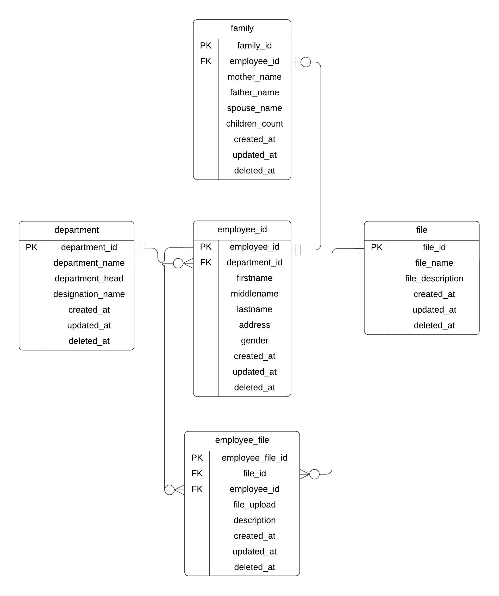
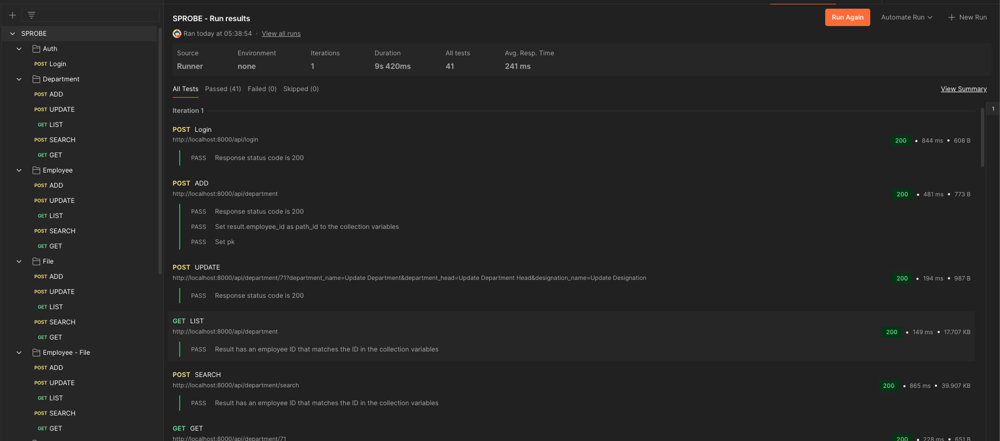
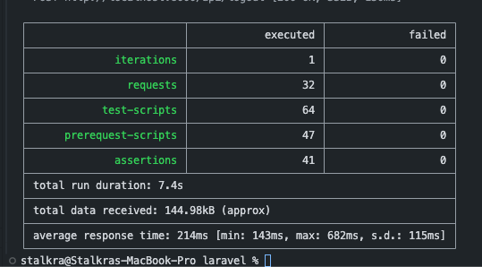

# Sprobe Developer Examination

This repository contains the source code for the Sprobe Developer Examination, a full-stack application demonstrating proficiency in modern web development technologies.

## Overview

The application serves as a comprehensive system for managing departments, employees, and their associated data. It features a responsive user interface built with React and Next.js, and a robust backend powered by Laravel. Key functionalities include CRUD operations, authentication, real-time notifications, and a well-tested API.

## Technologies Used

### Frontend

- **React**: A JavaScript library for building user interfaces.
- **Next.js**: A React framework for building server-rendered and static web applications.
- **ShadCN**: A collection of accessible and customizable UI components.

### Backend

- **Laravel**: A PHP web application framework.
- **Pusher**: A hosted service for adding real-time functionalities.
- **Auth Sanctum**: A lightweight authentication system for SPAs and mobile applications.
- **SQLite**: A C-language library that implements a small, fast, self-contained, high-reliability, full-featured, SQL database engine.

## Database Relationships

The system is designed with the following database relationships:

- **Department to Employee**: One-to-many / Many-to-one
- **Employee to Family**: One-to-one
- **Employee to Files**: Many-to-many (via employee_files pivot table)



## Features

### Frontend

- **Device Responsive Layout**: Optimized layout for various devices, including pages, tables, forms, and navigation menus.
- **Websocket Notification**: Real-time notifications for events within the application.
- **Responsive Form Display**: Forms are displayed in a drawer on web interfaces and a dialog on mobile devices.
- **Authentication**: Secure user authentication.
- **Dark Theme/Light Theme**: User-selectable theme options.
- **Tailored Fit CRUD Components**: Custom-built components for Create, Read, Update, and Delete operations, utilizing Tanstack Table, custom CRUD events, Axios calls, and advanced form features like form controls and popovers.
- **Event Bus**: A centralized system for handling notifications and displaying the latest events.

### Backend

- **Sanctum Authentication**: Secure API authentication using Laravel Sanctum.
- **Customized and Dynamic Model Interpretation**: Flexible handling of models, configurations, request handling, and request rules.
- **Bootstrapped Responses and Exceptions**: Consistent and predictable API responses and error handling.
- **Dynamic CRUD Events**: Object-Oriented Programming (OOP) principles applied to CRUD operations with robust try-catch blocks for error management.
- **Test Automation**: Comprehensive API testing using Postman and Newman, including 21 test files with 41 API tests.
- **Websocket Implementation**: Real-time communication powered by Pusher.
- **SQLite Database**: Lightweight and efficient database solution.
- **Modular Design**: Organized codebase with dedicated modules for Models, Factories, Seeders, and Migrations.
- **Audit Logs**: Automatic Audit Logging in every CRUD Request.
- **Soft Deletes**: Implementation of soft deletes for data archiving.

## Installation

### Prerequisites

Ensure you have Docker and Docker Compose installed on your system.

### Cloning the Repository

```bash
git clone <repository_url>
cd sprobe-developer-examination
```

### Installing Backend

Make sure port 8000 is free.

```bash
cd laravel
docker-compose up --build
```

The backend API will be accessible at [http://localhost:8000](http://localhost:8000).

### Installing Frontend

Make sure port 3000 is free.

```bash
cd react
docker-compose up --build
```

The frontend application will be accessible at [http://localhost:3000](http://localhost:3000).

### Accessing Application

Open Browser and Browse:

```text
http://localhost:3000/
```

Credentials

```text
Username: **test@example.com**
Password: **password**
```

### Running Tests

To run the backend API tests using Newman:

```bash
cd laravel
npm install -g newman
newman run crud_tests.json
```

### Test Results in POSTMAN



### Test Results in NEWMAN


